<h3><code>esk@github ~ $ ./contributions.sh</code></h3>

  

<h3><code>esk@github ~ $ whoami</code></h3>
<table>
<tr>
<td valign="top"></td>
<td valign="top"></td>
</tr>
</table>

 

<a href="https://elesh.dev"><code>elesh.dev</code></a> &nbsp;·&nbsp;
<a href="https://www.linkedin.com/in/elesh-kapri/"><code>linkedin</code></a>

